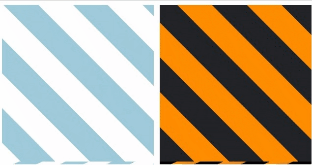

  

# Barber Poles Effect CSS

Imitación del efecto del típico poste de los barberos en CSS.

## Referencias

- [Customizing a striped background](https://blog.logrocket.com/5-ways-implement-striped-background-css-only/)
- [Barber Pole example in jsfiddle](https://jsfiddle.net/james_alley/hgdB8/)
- [orangepallette in color-hex](https://www.color-hex.com/color-palette/9369)
- [GIF extension chrome ggaabchcecdbomdcnbahdfddfikjmphe](https://chrome.google.com/webstore/detail/chrome-capture-screenshot/ggaabchcecdbomdcnbahdfddfikjmphe)
- [animation docs - Mozilla](https://developer.mozilla.org/en-US/docs/Web/CSS/animation)
- [What's the easiest way to code a barber pole effect in css? - Perplexity](https://www.perplexity.ai/search/914f3992-1540-4640-a6ef-12209273b099?s=u)
- [More stripes references](https://love2dev.com/blog/css-background-stripes/)
- [Never use pure black in typography - Medium](https://uxplanet.org/basicdesign-never-use-pure-black-in-typography-36138a3327a6)
